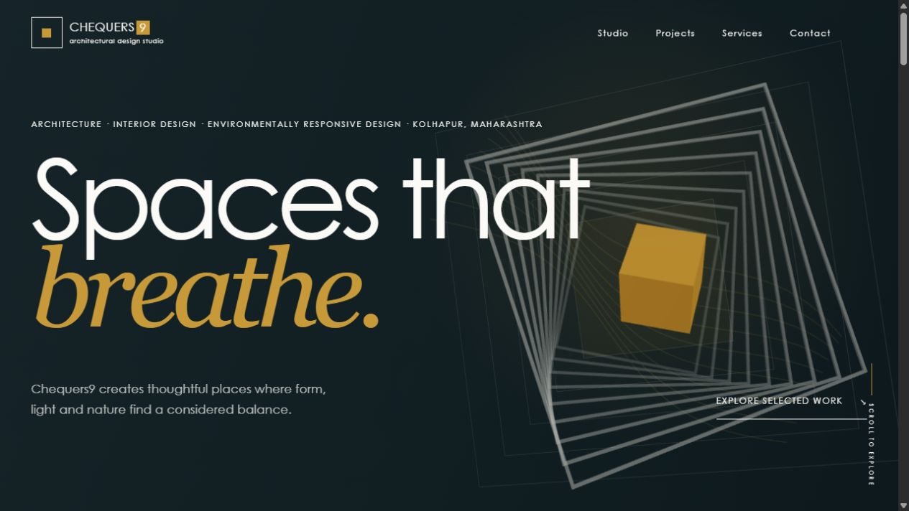

# Chequers9 Architectural Portfolio

A mobile-first portfolio website for **Chequers9 Architectural Design Studio**, built to present architecture and interior-design work through editorial typography, responsive photography, and an interactive Three.js hero.



## Who this project is for

This repository is a practical starting point for:

- architecture and interior-design studios that need a premium, image-led portfolio;
- photographers, designers, and other visual practices with project-based work;
- developers building a fast React portfolio whose content can later move to a CMS; and
- the Chequers9 team, who can update projects and studio information from two central files without editing page components.

## Highlights

- Mobile-first responsive interface with thumb-reachable bottom navigation.
- Interactive React Three Fiber hero inspired by the Chequers9 square logo.
- Pointer and scroll reactions on desktop, with reduced geometry and capped pixel density on lower-powered devices.
- Lazy-loaded 3D code so the hero does not delay initial page interactivity.
- Responsive AVIF and WebP project images with reserved dimensions and native lazy loading below the fold.
- Clip-path image reveals as the signature scroll interaction.
- Filterable project index, project galleries, next-project navigation, studio, services, and contact pages.
- Development-time validation for missing or duplicate project content.
- Page-specific SEO metadata plus generated sitemap, web manifest, favicons, and social preview image.
- Formspree contact form with client-side validation and success/error states.

## Quick start

### Requirements

- [Node.js](https://nodejs.org/) **20.19.0 or newer** (the repository includes `.nvmrc`)
- npm 10 or newer
- Git

Node 20.19 is used because the build-time Sharp image tooling and Vite 7 require a modern Node runtime.

### Install and run

```bash
git clone https://github.com/mineshrajput22/Chequers9.git
cd Chequers9
nvm use
npm install
cp .env.example .env
npm run dev
```

Open the local URL printed by Vite, normally `http://localhost:5173`.

On Windows PowerShell, create the environment file with:

```powershell
Copy-Item .env.example .env
```

The site runs without a configured contact endpoint, but the form cannot deliver messages until Formspree is configured.

## Environment variables

Create `.env` from `.env.example` and replace the placeholder:

```env
VITE_FORMSPREE_ENDPOINT=https://formspree.io/f/your-form-id
```

Only expose values intended for the browser through `VITE_*` variables. Never place private API keys in this file.

## Available commands

| Command | Purpose |
| --- | --- |
| `npm run dev` | Start the Vite development server with hot reload. |
| `npm run build` | Generate site assets and sitemap, then create the production build in `dist/`. |
| `npm run preview` | Serve the production build locally for final checks. |
| `npm run lint` | Run ESLint across JavaScript and JSX files. |
| `npm run optimize:images` | Generate 640, 1200, and 1800px AVIF/WebP variants from project source images. |
| `npm run generate:site-assets` | Regenerate icons, manifest-related assets, social image, and sitemap. |
| `npm run test:hero` | Test the device-capability rules used by the 3D hero. |

## Content editing

The interface is separated from the content. Project components receive data through props, so content changes do not require editing the homepage, project cards, filters, galleries, or detail pages.

### Site-wide content

Edit `src/content/site.js` to change:

- studio name and description;
- location, phone number, website, and WhatsApp link;
- navigation labels;
- service descriptions; and
- studio principles.

### Project content

All project data lives in `src/content/projects.js`. Each project follows this shape:

```js
{
  id: "03",
  slug: "arun-patil-residence",
  title: "Arun Patil Residence",
  clientLabel: "Project for Mr. Arun Patil",
  location: "Kolhapur",
  type: "architecture",
  description: "A considered response to place, light and everyday life.",
  cover: image(
    "arun-patil-residence",
    "cover",
    "Exterior view of the Arun Patil residence in Kolhapur"
  ),
  gallery: [
    image("arun-patil-residence", "01", "Front elevation at night")
  ],
  featured: true,
  services: ["Architecture"]
}
```

- Set `featured: true` to show a project on the homepage.
- Reorder objects to change project-index order.
- Reorder `gallery` entries to change gallery order.
- Leave optional text such as `location` empty; the UI removes the empty field cleanly.
- Use a unique two-digit `id` and URL-safe `slug` for every project.
- Write useful alt text that describes what is visible in each image.

The development build validates required project fields, cover data, duplicate IDs, and duplicate slugs. See [CONTENT_GUIDE.md](./CONTENT_GUIDE.md) for the short editor-focused workflow.

## Adding or replacing project images

1. Create `public/images/projects/<project-slug>/`.
2. Add originals named `source-cover.webp`, `source-01.webp`, `source-02.webp`, and so on.
3. Add matching `image(...)` entries to `src/content/projects.js`.
4. Run:

```bash
npm run optimize:images
```

The optimizer creates AVIF and WebP variants at 640, 1200, and 1800 pixels. Commit both the source images and generated variants so production builds do not depend on image conversion being run manually.

To replace an image, overwrite the corresponding `source-*.webp` file and run the optimizer again. To reorder a gallery, only reorder the entries in the `gallery` array.

### How image delivery works

Project images follow one predictable path from source file to browser:

```text
source-cover.webp
       │
       ▼  npm run optimize:images
cover-640.avif     cover-640.webp
cover-1200.avif    cover-1200.webp
cover-1800.avif    cover-1800.webp
       │
       ▼  image(...) in projects.js
AVIF srcset + WebP srcset + WebP fallback
       │
       ▼  ResponsiveImage
Browser selects the smallest suitable format and width
```

The `image(projectSlug, file, alt)` helper in `src/content/projects.js` builds the URLs and both source sets. Components never assemble image paths themselves.

`ResponsiveImage` renders a semantic `<picture>` element in this order:

1. AVIF source set for browsers that support AVIF.
2. WebP source set as the next choice.
3. A 1200px WebP `` fallback.

The component also:

- accepts a `sizes` value so the browser can choose the correct file before downloading;
- uses `loading="lazy"` by default for below-fold media;
- enables eager loading only for explicitly prioritised covers;
- uses asynchronous image decoding; and
- reserves a 3:2 image box with width and height attributes to reduce layout shift.

Keep source photography at a high enough resolution for the 1800px output. The current pipeline uses AVIF quality 64 and WebP quality 78. Change output widths or compression settings in `scripts/optimize-images.mjs` if the design requirements change.

## Routes

| URL | Page |
| --- | --- |
| `/` | Editorial homepage and selected work |
| `/about` | Studio story and principles |
| `/projects` | Filterable project index |
| `/projects/:id/:title` | Project details and gallery |
| `/services` | Architecture and interior-design services |
| `/contact` | Enquiry form and contact information |

Existing ID-based project URLs are preserved while links use safe project slugs.

## Project structure

```text
Chequers9/
├── docs/                       # README media
├── public/
│   └── images/projects/        # Source and responsive project images
├── scripts/                    # Image, icon, metadata, sitemap, and hero test tools
├── src/
│   ├── Components/             # Reusable UI, images, galleries, SEO, and 3D hero
│   ├── Pages/                  # Route-level page composition
│   ├── content/
│   │   ├── projects.js         # Canonical project collection
│   │   └── site.js             # Canonical site and service content
│   └── utils/                  # Shared capability and helper logic
├── .env.example
├── .nvmrc
└── package.json
```

## Code overview

### Application flow

```text
main.jsx
  └── HelmetProvider
      └── App.jsx / React Router
          └── Layout.jsx
              ├── Navbar + mobile navigation
              ├── ScrollToTop
              ├── active route via <Outlet />
              └── Footer

projects.js ──► Home, Projects, ProjectDetails
site.js     ──► navigation, services, footer, contact, SEO defaults
```

`src/main.jsx` mounts React in strict mode and provides the shared metadata context. `src/App.jsx` declares every public route. `src/Pages/Layout.jsx` supplies the common navigation, main landmark, footer, skip link, and scroll restoration around the active page.

Route-level files in `src/Pages/` compose the screens. Reusable rendering behavior stays in `src/Components/`, while editable business content stays in `src/content/`. This separation means a future CMS can replace the JavaScript content layer without requiring the page design to be rebuilt.

### Main components

| Component | Responsibility |
| --- | --- |
| `Brand` | Recreates the business-card mark and wordmark consistently. |
| `Navbar` | Desktop top navigation and thumb-reachable mobile navigation. |
| `HeroSection` | Renders the hero copy, immediate CSS line-study placeholder, and deferred 3D import. |
| `Hero3D` | Owns the Three.js scene, cube, continuous square frames, lights, pointer tracking, and scroll response. |
| `ResponsiveImage` | Central AVIF/WebP picture rendering and loading policy. |
| `ProjectCard` | Displays one project using only the passed project record. |
| `ProjectGallery` | Renders a project's optional gallery in content-defined order. |
| `ProjectMeta` | Hides empty metadata and presents location, type, and services. |
| `Reveal` | Applies the reusable scroll-triggered image reveal. |
| `SEO` | Creates titles, canonical URLs, Open Graph fields, and Twitter card metadata. |
| `EditorialSection` and `CTA` | Shared editorial layout and call-to-action patterns. |

### Project data flow

The project collection is the source for every project-facing feature:

- `Home` filters records where `featured` is `true`.
- `Projects` derives its cards and category filters from the collection.
- `ProjectDetails` finds a record by route `id`, combines its cover and gallery, and derives the next project from array order.
- `SEO` receives the same project's title, description, URL, and cover.
- `scripts/generate-sitemap.mjs` imports the collection and generates every project URL.

Adding or deleting one record therefore updates listings, detail pages, navigation, and the generated sitemap without duplicating content in components.

### 3D hero lifecycle

The HTML hero and CSS architectural-line study render immediately. `HeroSection` waits for browser idle time (or a short timeout where idle callbacks are unavailable), then dynamically imports `Hero3D` in a React `Suspense` boundary. The large Three.js bundle is consequently emitted as a separate production chunk and does not block the initial React interface.

Inside `Hero3D`:

- React Three Fiber owns the canvas and render loop.
- Three.js creates the extruded square frames, construction lines, gold cube, materials, and lighting.
- Pointer movement changes the sculpture's target rotation and position without requiring a click.
- Page scroll adjusts rotation, depth, vertical position, and scale.
- The cube continues rotating independently.
- `src/utils/heroCapability.js` reduces geometry and device-pixel ratio on devices reporting four or fewer logical CPU cores.
- Mobile keeps the scene touch-safe because the canvas does not capture pointer events; scrolling remains native.
- `prefers-reduced-motion` rules in `src/index.css` remove CSS transitions and reveal animation. The static CSS line study remains behind the canvas and while the 3D chunk is loading.

The resting orientation, camera, scale, pointer sensitivity, scroll response, frame count, and cube rotation speeds are intentionally grouped in `src/Components/Hero3D.jsx` for visual fine-tuning.

### Styling and responsive behavior

Global design tokens, typography, layout rules, breakpoints, focus states, animation, and the hero fallback live in `src/index.css`. Tailwind, PostCSS, and Autoprefixer remain configured in the toolchain; the current visual system primarily uses semantic component class names and custom CSS.

The desktop header becomes a bottom-anchored navigation bar on mobile. Project grids, editorial spacing, hero composition, and typography scale from the mobile layout upward rather than shrinking a desktop-only design.

### SEO and generated public assets

Each page renders metadata through `SEO`, using `src/content/site.js` for the production domain and default description. Project pages pass their own title, description, canonical route, content type, and cover image.

During `npm run build`:

1. `scripts/generate-site-assets.mjs` recreates the branded favicon and 192/512px application icons with Sharp.
2. `scripts/generate-sitemap.mjs` imports the current project collection and writes `public/sitemap.xml`.
3. Vite bundles the application into `dist/` and copies public assets.

`public/robots.txt`, `public/site.webmanifest`, and `public/og.png` provide crawler, install, and social-sharing support.

### Contact form flow

The contact form is controlled React state. Required browser validation runs first, while a hidden `company` honeypot silently ignores basic bot submissions. Valid enquiries are posted as JSON to `VITE_FORMSPREE_ENDPOINT`; the UI exposes sending, success, failure, and unconfigured states through an `aria-live` status region. No secret or server-side credential is stored in the application.

### Content and rendering validation

In development, `validateProjects()` checks required fields, unique IDs, unique slugs, and cover image source/alt data as soon as the content module loads. ESLint covers source consistency, the Node test verifies hero capability decisions, and the production build validates asset generation and bundling.

## Production build and deployment

Create and inspect a production build locally:

```bash
npm run lint
npm run test:hero
npm run build
npm run preview
```

Deploy the generated `dist/` directory to Netlify, Vercel, Cloudflare Pages, or another static host. Configure the host to:

- use Node `20.19.0` or newer;
- run `npm run build`;
- publish `dist`; and
- rewrite unknown paths to `/index.html` so React Router routes work when opened directly.

Set `VITE_FORMSPREE_ENDPOINT` in the hosting provider's environment settings before the production build.

## Accessibility and performance notes

- Interactive controls are designed around a minimum 44px touch target.
- Every navigation and project interaction works with touch and keyboard; hover is never required.
- Visible focus states, semantic landmarks, descriptive image alt text, and a skip link support keyboard and assistive-technology users.
- The 3D scene loads after initial content and degrades to a static architectural-line composition when appropriate.
- Below-fold images are lazy loaded and delivered through responsive AVIF/WebP source sets.
- Respect `prefers-reduced-motion` when adding new animation.

Before releasing major visual changes, test at 360px, 390px, 768px, and 1440px, then profile a production build with Chrome mobile throttling.

## Tech stack

- **Application:** React 18, React DOM, React Router 6
- **Build tooling:** Vite 7, npm, Node.js 20.19+
- **3D and motion:** Three.js, React Three Fiber, CSS transitions and clip-path reveals
- **Styling:** Tailwind CSS 3, PostCSS, Autoprefixer, custom CSS design tokens
- **Images and generated assets:** Sharp, AVIF, WebP, responsive `srcset`
- **SEO:** React Helmet Async, generated sitemap, robots.txt, web manifest, Open Graph image
- **Forms:** Formspree via `VITE_FORMSPREE_ENDPOINT`
- **Quality:** ESLint 9, Node's built-in test runner
- **Deployment:** Static `dist/` output suitable for Netlify, Vercel, Cloudflare Pages, or equivalent hosting
